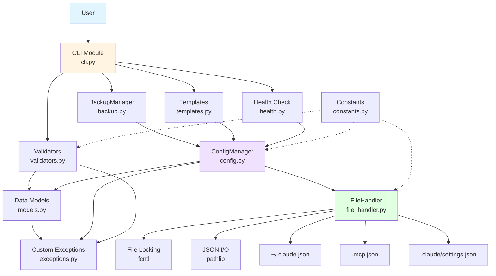

# Architecture Design

## Overview

MCP Manager는 4-Layer Architecture를 기반으로 설계되었습니다. 각 레이어는 명확한 책임을 가지며, 상위 레이어는 하위 레이어에만 의존합니다.

## Layered Architecture

```
┌─────────────────────────────────────────────────────────┐
│                  Presentation Layer                     │
│                    (CLI - Typer)                        │
│  - 사용자 입력 처리                                        │
│  - Rich 기반 출력 포맷팅                                   │
│  - 명령어 라우팅                                           │
└─────────────────────────────────────────────────────────┘
                          ↓
┌─────────────────────────────────────────────────────────┐
│                Business Logic Layer                     │
│                    (Core Logic)                         │
│  - Validators: 입력 검증                                  │
│  - BackupManager: 백업/복원 로직                          │
│  - Templates: 템플릿 관리                                 │
│  - Health: 서버 상태 확인                                 │
└─────────────────────────────────────────────────────────┘
                          ↓
┌─────────────────────────────────────────────────────────┐
│                 Data Access Layer                       │
│                  (ConfigManager)                        │
│  - Config CRUD 연산                                      │
│  - MCP 서버 추가/삭제/수정                                 │
│  - Scope 관리 (user/project/local)                      │
└─────────────────────────────────────────────────────────┘
                          ↓
┌─────────────────────────────────────────────────────────┐
│                Infrastructure Layer                     │
│                  (FileHandler)                          │
│  - Atomic File I/O                                      │
│  - File Locking (fcntl)                                 │
│  - JSON 직렬화/역직렬화                                    │
└─────────────────────────────────────────────────────────┘
                          ↓
                  ~/.claude.json
                   .mcp.json
```

## Component Diagram



## Dependency Rules

### 1. 단방향 의존성
- 상위 레이어만 하위 레이어를 참조
- 하위 레이어는 상위 레이어를 알 수 없음
- 순환 참조 엄격히 금지

### 2. 레이어 간 통신
```python
# ✓ Good: 상위 → 하위
from mcp_manager.config import ConfigManager  # CLI에서 ConfigManager 사용

# ✗ Bad: 하위 → 상위
from mcp_manager.cli import app  # ConfigManager에서 CLI 참조 금지

# ✓ Good: 같은 레이어
from mcp_manager.validators import validate_server_name
from mcp_manager.backup import BackupManager
```

### 3. 레이어 건너뛰기 금지
```python
# ✗ Bad: CLI에서 FileHandler 직접 사용
from mcp_manager.file_handler import atomic_write

# ✓ Good: CLI → ConfigManager → FileHandler
config_manager.save(config)  # ConfigManager가 FileHandler 사용
```

## Design Principles

### 1. Single Responsibility Principle (SRP)
각 모듈은 하나의 명확한 책임만 가집니다.

```python
# cli.py: 오직 사용자 인터페이스만
@app.command()
def add(name: str):
    """Add a new MCP server"""
    # 입력 받기 + 출력만
    pass

# validators.py: 오직 검증만
def validate_server_name(name: str) -> bool:
    """Validate server name format"""
    pass

# config.py: 오직 설정 CRUD만
class ConfigManager:
    def add_server(self, name: str, server: MCPServer):
        """Add server to config"""
        pass
```

### 2. Dependency Inversion Principle (DIP)
구체적인 구현이 아닌 추상화에 의존합니다.

```python
# Protocol (인터페이스)
class ConfigStore(Protocol):
    def load(self) -> Config: ...
    def save(self, config: Config) -> None: ...

# 구현체
class FileConfigStore:
    def load(self) -> Config:
        return json.load(...)

    def save(self, config: Config) -> None:
        json.dump(...)

# ConfigManager는 추상화에 의존
class ConfigManager:
    def __init__(self, store: ConfigStore):
        self.store = store  # 구체 클래스가 아닌 Protocol
```

### 3. Separation of Concerns
관심사를 명확히 분리합니다.

```python
# CLI: 표현 관심사
def display_servers(servers: dict[str, MCPServer]):
    table = Table(title="MCP Servers")
    for name, server in servers.items():
        table.add_row(name, server.type, ...)
    console.print(table)

# ConfigManager: 비즈니스 관심사
def add_server(self, name: str, server: MCPServer):
    if name in self.config.mcpServers:
        raise ServerAlreadyExistsError(name)
    self.config.mcpServers[name] = server

# FileHandler: 인프라 관심사
def atomic_write(path: Path, data: str):
    temp = path.with_suffix('.tmp')
    temp.write_text(data)
    temp.rename(path)  # Atomic
```

## Module Interaction Flow

### Add Server Flow
```
User Input
    ↓
CLI.add(name, type, command, ...)
    ↓
validate_server_name(name)          ← validators.py
validate_command(command)           ← validators.py
    ↓
server = MCPServer(...)             ← models.py
    ↓
ConfigManager.add_server(name, server)
    ↓
ConfigManager.save(config)
    ↓
FileHandler.atomic_write(path, json)
    ↓
fcntl.flock(LOCK_EX)
    ↓
Write to ~/.claude.json
    ↓
Success / Error
```

### Backup Flow
```
User Input
    ↓
CLI.backup_create()
    ↓
BackupManager.create()
    ↓
ConfigManager.load()                ← 현재 config 읽기
    ↓
Backup(timestamp, config, metadata)  ← models.py
    ↓
FileHandler.atomic_write(backup_path, json)
    ↓
Success
```

## Error Handling Architecture

각 레이어는 자신의 예외를 정의하고 처리합니다.

```python
# Infrastructure Layer
class FileIOError(MCPManagerError):
    """File I/O operation failed"""

# Data Layer
class ConfigError(MCPManagerError):
    """Configuration error"""

# Business Layer
class ValidationError(MCPManagerError):
    """Validation failed"""

# Presentation Layer
try:
    config_manager.add_server(name, server)
except ValidationError as e:
    console.print(f"[red]✗[/] {e}")
    console.print("Fix: Use valid server name (a-z0-9-_)")
    sys.exit(1)
```

## Extensibility Points

### 1. New Server Types
새로운 MCP 서버 타입 추가 시:

```python
# models.py
class MCPServerType(str, Enum):
    STDIO = "stdio"
    SSE = "sse"
    HTTP = "http"
    GRPC = "grpc"  # 새로운 타입

# validators.py
def validate_grpc_server(server: MCPServer):
    if not server.url:
        raise ValidationError("gRPC server requires url")
```

### 2. New Storage Backends
파일 외 다른 저장소 지원 시:

```python
# config.py
class CloudConfigStore(ConfigStore):
    def load(self) -> Config:
        return fetch_from_cloud(...)

    def save(self, config: Config):
        upload_to_cloud(...)

# CLI에서 선택
store = CloudConfigStore() if use_cloud else FileConfigStore()
manager = ConfigManager(store)
```

### 3. New Commands
새 명령어 추가 시:

```python
# cli.py
@app.command()
def sync():
    """Sync MCP servers across devices"""
    # ConfigManager + CloudSync 사용
    pass
```

## Performance Considerations

### 1. Lazy Loading
```python
class ConfigManager:
    _config: Config | None = None

    @property
    def config(self) -> Config:
        if self._config is None:
            self._config = self.load()
        return self._config
```

### 2. Caching
```python
@lru_cache(maxsize=128)
def get_allowed_commands() -> list[str]:
    return ["uvx", "npx", "node", "python", "docker"]
```

### 3. Atomic Operations
```python
# 항상 atomic write 사용
def save(self, config: Config):
    # temp → write → rename (atomic)
    atomic_write(self.config_path, config.model_dump_json())
```

## Testing Architecture

각 레이어는 독립적으로 테스트 가능합니다.

```python
# Unit Test: validators.py
def test_validate_server_name():
    assert validate_server_name("my-server")
    assert not validate_server_name("My Server")

# Integration Test: ConfigManager
def test_add_remove_server(tmp_path):
    manager = ConfigManager(tmp_path / "config.json")
    manager.add_server("test", MCPServer(...))
    assert "test" in manager.config.mcpServers

# E2E Test: CLI
def test_cli_add(cli_runner):
    result = cli_runner.invoke(app, ["add", "test", ...])
    assert result.exit_code == 0
```

## Deployment Architecture

```
Development
    ↓
uv build
    ↓
PyPI Package (mcp-manager-0.1.0.tar.gz)
    ↓
User Installation
    ├── uv tool install mcp-manager
    ├── pipx install mcp-manager
    └── pip install mcp-manager
    ↓
~/.local/bin/mcpm (executable)
```

## Summary

MCP Manager의 아키텍처는:
- **4-Layer 구조**: 명확한 책임 분리
- **단방향 의존성**: 순환 참조 없음
- **SOLID 원칙**: 유지보수성 향상
- **확장 가능**: 새 기능 추가 용이
- **테스트 가능**: 각 레이어 독립 테스트

이 설계를 통해 안정적이고 확장 가능한 CLI 도구를 구축합니다.
