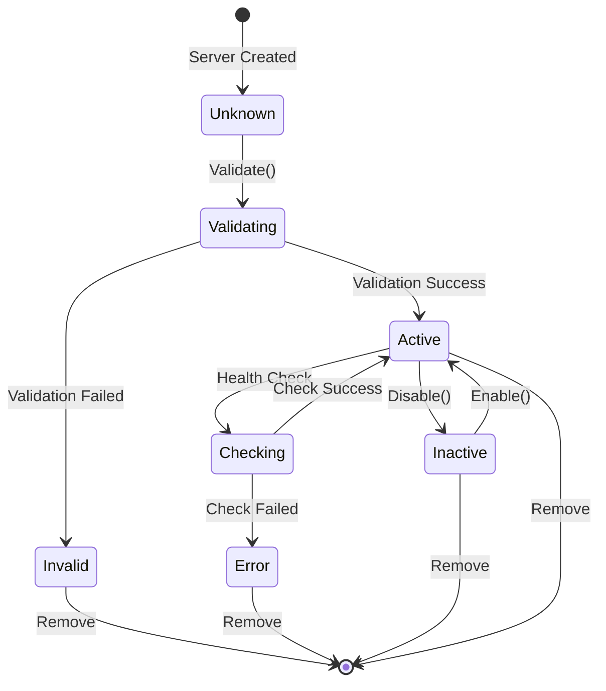

# Data Models Design

## Overview

MCP Manager는 Pydantic v2를 사용하여 타입 안전성과 자동 검증을 보장합니다. 모든 데이터 모델은 `BaseModel`을 상속받아 정의됩니다.

## Domain Models

### MCPServerType (Enum)

MCP 서버의 전송 프로토콜 타입을 정의합니다.

```python
from enum import Enum

class MCPServerType(str, Enum):
    """MCP server transport types"""
    STDIO = "stdio"  # Local process communication
    SSE = "sse"      # Server-Sent Events (deprecated)
    HTTP = "http"    # HTTP/HTTPS transport
```

**Usage:**
```python
server_type = MCPServerType.STDIO
assert server_type == "stdio"
assert server_type.value == "stdio"
```

---

### MCPServer (Model)

개별 MCP 서버의 설정을 나타냅니다.

```python
from pydantic import BaseModel, Field, field_validator
from typing import Optional

class MCPServer(BaseModel):
    """MCP server configuration"""

    type: MCPServerType
    """Server transport type (stdio, sse, http)"""

    # Stdio-specific fields
    command: Optional[str] = None
    """Executable command (required for stdio)"""

    args: list[str] = Field(default_factory=list)
    """Command-line arguments"""

    env: dict[str, str] = Field(default_factory=dict)
    """Environment variables"""

    # HTTP/SSE-specific fields
    url: Optional[str] = None
    """Server URL (required for http/sse)"""

    headers: dict[str, str] = Field(default_factory=dict)
    """HTTP headers (for authentication)"""

    @field_validator("command")
    @classmethod
    def validate_stdio_command(cls, v, info):
        """Stdio servers must have command"""
        if info.data.get("type") == MCPServerType.STDIO and not v:
            raise ValueError("stdio servers require 'command' field")
        return v

    @field_validator("url")
    @classmethod
    def validate_http_url(cls, v, info):
        """HTTP/SSE servers must have URL"""
        server_type = info.data.get("type")
        if server_type in (MCPServerType.HTTP, MCPServerType.SSE) and not v:
            raise ValueError(f"{server_type} servers require 'url' field")
        return v

    class Config:
        use_enum_values = True  # Serialize enum as string
        json_schema_extra = {
            "examples": [
                {
                    "type": "stdio",
                    "command": "uvx",
                    "args": ["mcp-server-time"],
                    "env": {}
                },
                {
                    "type": "http",
                    "url": "https://api.example.com/mcp",
                    "headers": {
                        "Authorization": "Bearer ${API_TOKEN}"
                    }
                }
            ]
        }
```

**Field Constraints:**

| Field | Type | Required | Applies To | Notes |
|-------|------|----------|-----------|-------|
| `type` | MCPServerType | Yes | All | stdio, sse, http |
| `command` | str | Yes | stdio | Executable path |
| `args` | list[str] | No | stdio | Default: [] |
| `env` | dict[str, str] | No | stdio | Default: {} |
| `url` | str | Yes | http, sse | Remote endpoint |
| `headers` | dict[str, str] | No | http, sse | Default: {} |

---

### Config (Model)

전체 `~/.claude.json` 구조를 나타냅니다.

```python
from pydantic import BaseModel, Field

class Config(BaseModel):
    """Claude Code configuration (~/.claude.json)"""

    mcpServers: dict[str, MCPServer] = Field(default_factory=dict)
    """MCP server configurations"""

    # Additional fields from ~/.claude.json (read-only)
    numStartups: Optional[int] = None
    installMethod: Optional[str] = None
    autoUpdates: Optional[bool] = None
    theme: Optional[str] = None
    verbose: Optional[bool] = None
    # ... other fields

    class Config:
        # Ignore unknown fields when loading
        extra = "allow"

        json_schema_extra = {
            "example": {
                "mcpServers": {
                    "time": {
                        "type": "stdio",
                        "command": "uvx",
                        "args": ["mcp-server-time"],
                        "env": {}
                    },
                    "github": {
                        "type": "http",
                        "url": "https://api.githubcopilot.com/mcp/",
                        "headers": {}
                    }
                }
            }
        }
```

**Design Decisions:**
- `mcpServers`: 우리가 관리하는 핵심 필드
- 기타 필드: Claude Code가 관리하는 필드 (읽기 전용)
- `extra = "allow"`: 알 수 없는 필드 보존 (호환성)

---

### Scope (Enum)

MCP 서버 설정의 범위를 정의합니다.

```python
class Scope(str, Enum):
    """Configuration scope levels"""
    USER = "user"        # ~/.claude.json
    PROJECT = "project"  # .mcp.json
    LOCAL = "local"      # .claude/settings.json
```

**Scope Priority:**
```
Local (highest) → Project → User (lowest)
```

---

### Backup (Model)

백업 데이터를 나타냅니다.

```python
from datetime import datetime
from pydantic import BaseModel, Field

class Backup(BaseModel):
    """Configuration backup"""

    timestamp: datetime = Field(default_factory=datetime.now)
    """Backup creation time"""

    config: Config
    """Backed up configuration"""

    metadata: dict[str, str] = Field(default_factory=dict)
    """Additional metadata (reason, user, etc.)"""

    @property
    def backup_id(self) -> str:
        """Unique backup identifier"""
        return self.timestamp.strftime("%Y%m%d-%H%M%S")

    class Config:
        json_schema_extra = {
            "example": {
                "timestamp": "2024-12-02T12:00:00",
                "config": {"mcpServers": {...}},
                "metadata": {
                    "reason": "before_update",
                    "user": "ragtime"
                }
            }
        }
```

---

## JSON Schema

### MCPServer Schema

```json
{
  "$schema": "http://json-schema.org/draft-07/schema#",
  "title": "MCPServer",
  "type": "object",
  "required": ["type"],
  "properties": {
    "type": {
      "type": "string",
      "enum": ["stdio", "sse", "http"]
    },
    "command": {
      "type": "string",
      "description": "Executable command (stdio only)"
    },
    "args": {
      "type": "array",
      "items": {"type": "string"},
      "default": []
    },
    "env": {
      "type": "object",
      "additionalProperties": {"type": "string"},
      "default": {}
    },
    "url": {
      "type": "string",
      "format": "uri",
      "description": "Server URL (http/sse only)"
    },
    "headers": {
      "type": "object",
      "additionalProperties": {"type": "string"},
      "default": {}
    }
  },
  "allOf": [
    {
      "if": {
        "properties": {"type": {"const": "stdio"}}
      },
      "then": {
        "required": ["command"]
      }
    },
    {
      "if": {
        "properties": {"type": {"enum": ["http", "sse"]}}
      },
      "then": {
        "required": ["url"]
      }
    }
  ]
}
```

---

## State Diagram

MCP 서버의 생명주기를 나타냅니다.



**State Descriptions:**
- **Unknown**: 초기 상태, 검증 전
- **Validating**: 검증 진행 중
- **Active**: 정상 동작 가능
- **Inactive**: 비활성화됨 (사용자 요청)
- **Error**: 오류 상태 (health check 실패)
- **Invalid**: 잘못된 설정

---

## Data Validation Rules

### Server Name Validation

```python
import re

def validate_server_name(name: str) -> bool:
    """
    Valid server names:
    - Lowercase alphanumeric
    - Hyphens and underscores allowed
    - Must start with letter
    - 1-64 characters
    """
    pattern = r'^[a-z][a-z0-9_-]{0,63}$'
    return bool(re.match(pattern, name))

# Valid:   "time", "my-server", "db_client"
# Invalid: "MyServer", "123abc", "my server", "a"*65
```

### Command Validation

```python
import shutil

ALLOWED_COMMANDS = {"uvx", "npx", "node", "python", "python3", "docker"}

def validate_command(command: str) -> bool:
    """
    Valid commands:
    - In ALLOWED_COMMANDS whitelist, OR
    - Absolute path to existing executable
    """
    # Check whitelist
    if command in ALLOWED_COMMANDS:
        return True

    # Check if executable exists
    if shutil.which(command):
        return True

    raise ValueError(
        f"Command '{command}' not allowed. "
        f"Allowed: {', '.join(ALLOWED_COMMANDS)}"
    )
```

### URL Validation

```python
from pydantic import HttpUrl

def validate_url(url: str) -> bool:
    """Valid URLs must be http:// or https://"""
    try:
        HttpUrl(url)
        return True
    except ValidationError:
        raise ValueError(f"Invalid URL: {url}")
```

---

## Data Flow

### Load Config Flow

```
File (~/.claude.json)
    ↓
Read JSON string
    ↓
json.loads()
    ↓
dict
    ↓
Config.model_validate(dict)
    ↓ (Pydantic validation)
Config object
    ↓
config.mcpServers["time"]
    ↓
MCPServer object
```

### Save Config Flow

```
Config object
    ↓
config.model_dump(mode='json')
    ↓
dict
    ↓
json.dumps(dict, indent=2)
    ↓
JSON string
    ↓
atomic_write(path, json_str)
    ↓
File (~/.claude.json)
```

---

## Example Usage

### Create a stdio server

```python
server = MCPServer(
    type=MCPServerType.STDIO,
    command="uvx",
    args=["mcp-server-time"],
    env={"TZ": "UTC"}
)

# Validation happens automatically
assert server.type == MCPServerType.STDIO
assert server.command == "uvx"
```

### Create an HTTP server

```python
server = MCPServer(
    type=MCPServerType.HTTP,
    url="https://api.example.com/mcp",
    headers={"Authorization": "Bearer ${API_TOKEN}"}
)

# Validation ensures url is present
assert server.url is not None
```

### Invalid server (missing required field)

```python
try:
    server = MCPServer(
        type=MCPServerType.STDIO
        # Missing 'command'!
    )
except ValidationError as e:
    print(e)
    # ValidationError: stdio servers require 'command' field
```

### Load config from file

```python
import json
from pathlib import Path

config_path = Path.home() / ".claude.json"
data = json.loads(config_path.read_text())
config = Config.model_validate(data)

# Access servers
time_server = config.mcpServers.get("time")
if time_server:
    print(f"Time server: {time_server.command} {' '.join(time_server.args)}")
```

### Save config to file

```python
# Modify config
config.mcpServers["new-server"] = MCPServer(
    type=MCPServerType.STDIO,
    command="npx",
    args=["-y", "@example/mcp-server"]
)

# Serialize
json_str = json.dumps(config.model_dump(mode='json'), indent=2)

# Write atomically
atomic_write(config_path, json_str)
```

---

## Pydantic Configuration

### Global Settings

```python
# models.py
from pydantic import ConfigDict

class MCPServer(BaseModel):
    model_config = ConfigDict(
        # Validation
        validate_assignment=True,  # Validate on attribute assignment
        validate_default=True,     # Validate default values

        # Serialization
        use_enum_values=True,      # Serialize enums as values

        # JSON Schema
        json_schema_extra={
            "examples": [...]
        }
    )
```

### Custom Validators

```python
from pydantic import field_validator, model_validator

class MCPServer(BaseModel):
    # Field validator (individual field)
    @field_validator("command")
    @classmethod
    def validate_command(cls, v):
        if v and not shutil.which(v):
            raise ValueError(f"Command not found: {v}")
        return v

    # Model validator (cross-field validation)
    @model_validator(mode='after')
    def validate_server(self):
        if self.type == MCPServerType.STDIO:
            if not self.command:
                raise ValueError("stdio servers require command")
        return self
```

---

## Data Integrity

### Immutable Fields

```python
from pydantic import Field

class Backup(BaseModel):
    timestamp: datetime = Field(frozen=True)  # Cannot be modified
    config: Config = Field(frozen=True)
```

### Default Factories

```python
class MCPServer(BaseModel):
    args: list[str] = Field(default_factory=list)  # New list for each instance
    env: dict[str, str] = Field(default_factory=dict)  # New dict

# ✗ Bad: Mutable default
args: list[str] = []  # Shared across instances!

# ✓ Good: Factory function
args: list[str] = Field(default_factory=list)
```

---

## Summary

MCP Manager의 데이터 모델은:
- **Pydantic v2**: 타입 안전성 + 자동 검증
- **명확한 스키마**: JSON Schema 호환
- **검증 규칙**: 필드별 + 모델별 검증
- **상태 관리**: 서버 생명주기 추적
- **데이터 무결성**: Immutable fields, default factories

이 설계를 통해 안전하고 신뢰할 수 있는 데이터 처리를 보장합니다.
